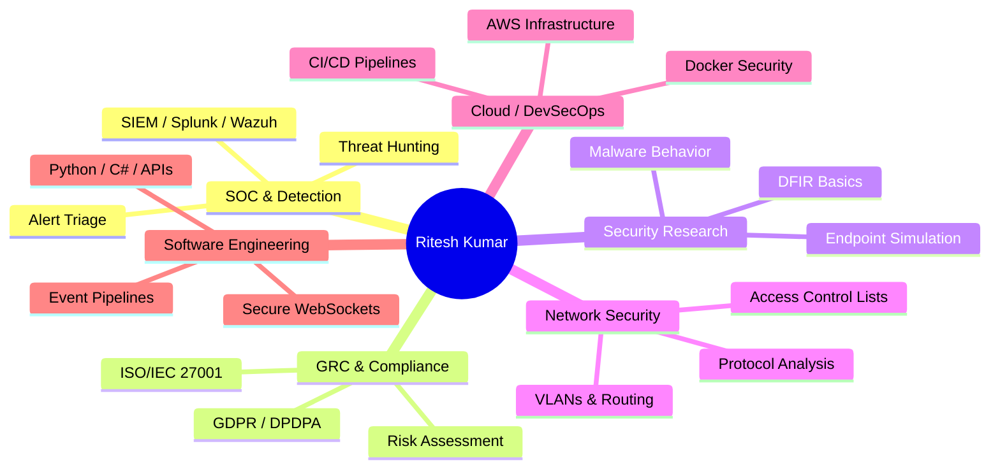
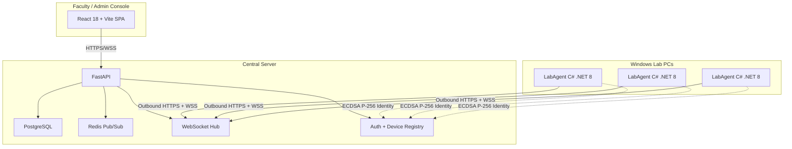
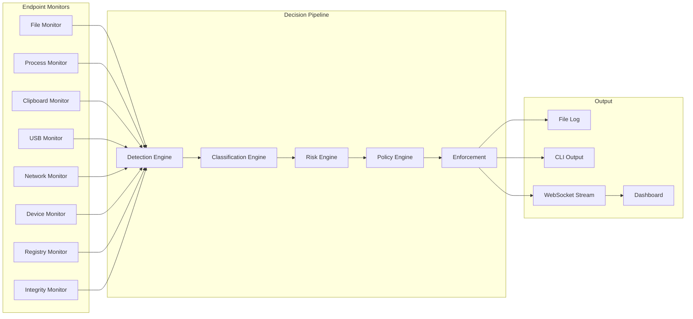

<!-- ============================================================
     RITESH KUMAR — GitHub Profile README
     Repository: Riteshkumar1205/Riteshkumar1205
     
     CONTENT MODEL:
     • Lines between DYNAMIC-METRICS markers are auto-generated
     • Everything else is human-maintained
     • See docs/automation.md for details
     ============================================================ -->

<div align="center">

# Ritesh Kumar

**Cybersecurity & Software Engineer**
**SOC Operations • GRC • Secure Systems • Automation**

<br>

[](https://github.com/Riteshkumar1205)
[](https://linkedin.com/in/ritesh-kumar-k78590)
[](mailto:riteshhare@gmail.com)
[](https://exploit-haven-desk.lovable.app)
[](https://tryhackme.com/p/RITESH26)
[](https://app.hackthebox.com/profile/Hackglb2025)
[](https://leetcode.com/u/RiteshKumar2512/)

</div>

---

## ⚡ Recruiter Quick View

```text
┌──────────────────────────────────────────────────────────────────┐
│ SECURITY PROFILE                                                 │
│ SOC • GRC • Security Engineering • Network Security              │
│                                                                  │
│ ENGINEERING STACK                                                │
│ Python • Backend (FastAPI/Flask) • APIs • Docker • AWS • C#      │
│                                                                  │
│ EVIDENCE OF WORK                                                 │
│ Production-grade Projects • Internships • Certifications         │
│                                                                  │
│ CURRENT FOCUS                                                    │
│ Detection Engineering • Security Architecture • Cyber Research   │
└──────────────────────────────────────────────────────────────────┘
```

---

## 🧭 360° Security & Engineering View

I approach engineering as a holistic discipline where security is built-in, not bolted on. My capability spans six core dimensions:



---

## 📊 Live Security Dashboard

<!-- DYNAMIC-METRICS:START — Auto-generated metrics from platform APIs -->
> **GitHub:** 33 public repositories · 5 followers · 6 total stars
> **LeetCode:** 454 problems solved (Easy: 154 · Medium: 229 · Hard: 71)
>
> *Automatically updated · Last refresh: 2026-10-02 12:02 UTC*
<!-- DYNAMIC-METRICS:END -->

<div align="center">
  
  
</div>

---

## 📈 Security Maturity / Capability Map

| Capability Area | Maturity | Evidence Base |
| :--- | :--- | :--- |
| **SOC & SIEM** | `████████░░` | Projects + Labs + Internship |
| **GRC** | `███████░░░` | ISO 27001 + Risk + Compliance |
| **Network Security** | `████████░░` | Cisco + Wireshark + CTF Projects |
| **Security Engineering** | `████████░░` | DLP + Endpoint Activity Monitor + SecureQR |
| **Software Engineering** | `████████░░` | Backend Architectures + APIs + Full Stack |

---

## 🧾 Proof of Work Layer

This profile is evidence-driven. Here is how my capabilities translate into tangible experience:

<details>
<summary><b>SOC & Security Monitoring</b></summary>

- **Tools**: Splunk, Wazuh, Wireshark, Windows Event Viewer
- **Skills**: Log Analysis, Event Correlation, Alert Triage
- **Evidence**: Production-grade implementation in **DLP Intelligence** & hands-on lab projects.
</details>

<details>
<summary><b>GRC & Compliance</b></summary>

- **Tools/Frameworks**: ISO/IEC 27001, GDPR, DPDPA
- **Skills**: Gap Analysis, Security Controls, Risk Assessment
- **Evidence**: Project-based risk scoring engines and compliance-oriented documentation.
</details>

<details>
<summary><b>Security Engineering</b></summary>

- **Implementation**: Cryptographic Device Identity, Policy Enforcement, Real-time event pipelines.
- **Evidence**: **LabAgent** (ECDSA P-256 identity + DPAPI key protection) & **SecureQR-COE**.
</details>

<details>
<summary><b>Network Security</b></summary>

- **Protocols**: TCP/IP, DNS, HTTP/HTTPS, ARP, ICMP, UDP
- **Evidence**: Cisco Networking Academy internship (VLANs, static routing, ACLs) and **WiFiScanner-Sniffer** project.
</details>

---

## 🏗️ Architecture Gallery

<details>
<summary><b>View Architecture: LabAgent (Endpoint Management)</b></summary>


</details>

<details>
<summary><b>View Architecture: DLP Intelligence</b></summary>


</details>

---

## 📅 Security Research Timeline

```text
2025
│
├── Cybersecurity Internship (Cisco Networking Academy x AICTE)
├── Software & Security Internship (InternPro)
├── Networking / SOC Labs
├── DLP / Endpoint Security Platform Development
│
2026
│
├── SecureQR / LabAgent Architectures
├── Security Research (Endpoint Activity Simulation)
├── GRC / ISO 27001 Deep Dives
└── Advanced Detection Engineering
```

---

## 🛠️ Recently Updated

<!-- DYNAMIC-RECENT:START -->
- **[Profile](https://github.com/Riteshkumar1205/Profile)** — *Updated: October 01, 2026*
- **[dsa-practice-2025](https://github.com/Riteshkumar1205/dsa-practice-2025)** — *Updated: September 29, 2026*
- **[SecureQR-COE](https://github.com/Riteshkumar1205/SecureQR-COE)** — *Updated: September 03, 2026*
- **[LabAgent](https://github.com/Riteshkumar1205/LabAgent)** — *Updated: August 31, 2026*
<!-- DYNAMIC-RECENT:END -->

---

## 🏆 Certifications & Achievements

- **Best Innovation in Prototype Designing** — MEDHA 2025, IIT Bombay BETiC (SmileCare Dental Health Analysis)
- **Cybersecurity Essentials & Foundations** — Cisco Networking Academy
- **Networking Basics** — Cisco Networking Academy
- **Cybersecurity Fundamentals** — Palo Alto Networks
- **AWS Cloud Foundations** — AWS Academy
- **SOC Analyst (Blue Team)** — Blue Cape Security
- **Red Hat System Administration** — Red Hat

*(Credential IDs and verification URLs available upon request.)*

---

## Connect & Collaborate

<div align="center">

**Interested in security engineering, SOC operations, or backend systems?**

[](https://github.com/Riteshkumar1205?tab=repositories)
[](https://linkedin.com/in/ritesh-kumar-k78590)
[](https://exploit-haven-desk.lovable.app)
[](mailto:riteshhare@gmail.com)

</div>

---

<div align="center">
<sub>Building security-focused systems — one commit at a time.</sub>
</div>
